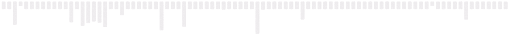

# Salut, je suis Rayane 👋

### 🎓 Étudiant en LP MICDTL

Je suis actuellement en 3ème année de LP avec une spécialisation en développement d'applications. Passionné par la programmation et le développement de solutions logicielles, je travaille sur des projets variés pour renforcer mes compétences.

- 💻 Langages : Python, PHP, SQL, JavaScript
- 🌐 Web : HTML, CSS, Bootstrap, React, Django
- 🛠️ Outils : Git, GitHub, PhpStorm, PyCharm

🚀 **Projets récents** :
- Développement d'une application de gestion des stocks.
- Création d'un site web dynamique avec React et Three.js.

🔗 **Connecte-toi avec moi sur GitHub pour suivre mes projets !**

- **GitHub:** [@LaKensak](https://github.com/LaKensak)
- **LinkedIn:** [@Rayane](https://www.linkedin.com/in/rayane-charkaoui-786a25235)

